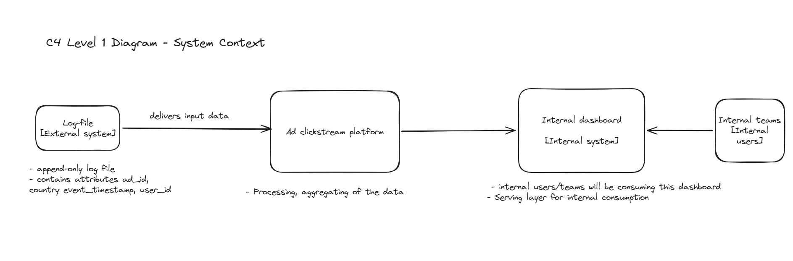
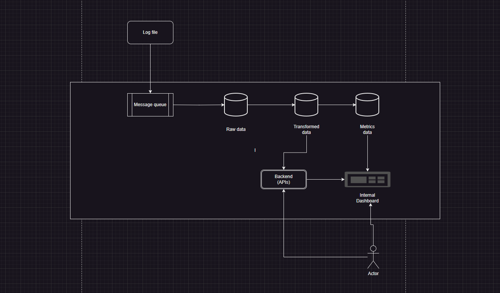
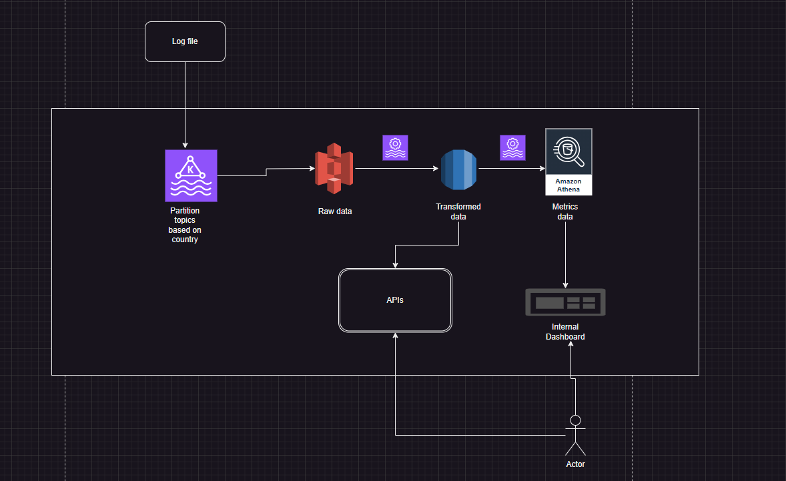

# Ad Click Stream Architecture Kata

## Functional Requirements:
- Build an internal dashboard for users
- Metrics that it would need to contain:
    - Click through Rate for each event (ad)
    - Top performing ads
    - Aggregations possible by country, user_id, ad_id

## Non-functional requirements:
- 1 billion Daily Active Users
- Each user AVG 1 ad per day
- Ad click QPS ~ 10 000
- Peak QPS 50 000
- Each event 0.1KB ~daily storage 100GB ~ 3TB monthly

### High Level Architecture

1. System Context Diagram

2. Container Diagram

3. Component Diagram

### API Design
 
 1. GET  /v1/ads/{ad_id}/start_time={start_time}/end_time={end_time}/count
 

Input Parameters:

- start time
- end_time
- country_filter (Optional)
- user_id_filter (Optional)
- ad_id_filter (Optional)

Response:
- ad_id
- count

 2. GET /v1/ads//start_time={start_time}/end_time={end_time}/top_performing_ads

Input Parameters:

- num_ads (to display)
- start_time
- end_time
- country_filter (Optional)
- user_id_filter (Optional)

Response:
- List of top performing ads_ids

3. GET  /v1/ads/{ad_id}

To get details of each ad

Response:
- ad_id
- ad_description
- source
- target_platform
- ad_event_start_date
- ad_event_end_date

### Tech Stack
- Cloud: AWS
- APIs: REST APIs, HTTPS
- Bronze layer storage: S3
- Silver layer storage: RDS
- Gold layer storage: Athena
- Message Queue: Kafka
- Processing: Flink

### Data Model
WIP

### Scalability/Performance
WIP

### Self-relfection doc
[Arch Kata: Attendee self-reflection - Ad Click Stream](https://docs.google.com/document/d/1siwaBOk6ZsgLMTTJhdhNFWZO0dNU-D1oXZI-rlrHY5w/edit?usp=sharing)